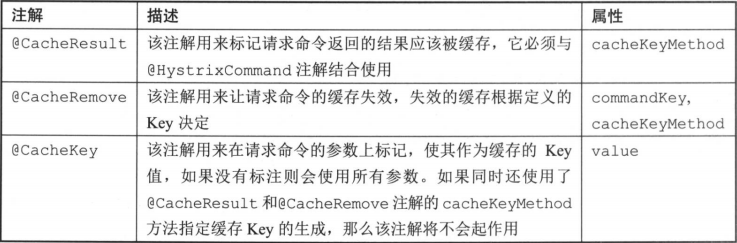

服务容错保护：Spring Cloud Hystrix
=========

　　在微服务架构中，存在着那么多的服务单元，若一个单元出现故障，就很容易因依赖关系而引发故障的蔓延，最终导致整个系统的瘫痪，这样的架构相较传统架构更加不稳定。为了解决这样的问题，产生了断路器等一系列的服务保护机制。

　　在分布式架构中，当某个服务单元发生故障(类似用电器发生短路)之后，通过断路器的故障监控(类似熔断保险丝)，向调用方返回一个错误响应，而不是长时间的等待。这样就不会使得线程因调用故障服务被长时间占用不释放，避免了故障在分布式系统中的蔓延。

　　针对上述问题，Spring Cloud Hystrix实现了断路器、线程隔离等一系列服务保护功能。它也是基于Netlix的开源框架Hystrix实现的，该框架的目标在于通过控制那些访问远程系统、服务和第三方库的节点，从而对延迟和故障提供更强大的容错能力。**Hystrix具备服务降级、服务熔断、线程和信号隔离、请求缓存、请求合并以及服务监控等强大功能。**

## 1、快速入门
**需要启动/准备的工程：**
- eureka-server工程：服务注册中心
- customer-service工程：服务消费者，请求调用生产者

**开始引入Spring Cloud Hystrix**
- 引入依赖
  ```xml
  <dependency>
      <groupId>org.springframework.cloud</groupId>
      <artifactId>spring-cloud-starter-hystrix</artifactId>
      <version>1.4.0.RELEASE</version>
  </dependency>
  ```

- customer-service工程启动类使用@EnableCircuitBreaker注解开启断路器功能
  ```java
  @EnableCircuitBreaker
  @EnableDiscoveryClient
  @SpringBootApplication
  public class CustomerApplication {

      @Bean
      @LoadBalanced
      RestTemplate restTemplate() {
          return new RestTemplate();
      }

      public static void main (String[] args) {
          SpringApplication.run(CustomerApplication.class, args);
      }
  }
  ```

- 增加服务消费方式，在函数上增加@HystrixCommand 解来指定回调方法:
  ```java
  @Service
  public class CustomerClient {

      @Autowired
      RestTemplate restTemplate;

      @HystrixCommand(fallbackMethod = "customerFallback")
      public String customerClient() {
          return restTemplate.getForEntity("http://xxx", String.class).getBody();
      }

      public String customerFallback() {
          return "error of Hystrix";
      }
  }
  ```

- 新增ConsumerController类，注入上面实现的CustomerClient实例，并在customer中进行调用:
  ```java
  @RestController
  public class CustomerController {

      @Autowired
      private CustomerClient customerClient;

      @GetMapping("customer")
      public String customer() {
          return customerClient.customerClient();
      }
  }
  ```

　　访问http://xxx ，我们可以观察到，customer-service工程会返回error of Hystrix，即服务消费者因调用的服务超时从而触发熔断请求，并调用回调逻辑返回结果。

## 2、使用详解
　　通过@HystrixCommand创建了HystrixCommand的实现，同时利用fallback属性指定了服务降级的实现方法。然而这些还只是Hystrix 使用的一小部分， 在实现一个大型分布式系统时，往往还需要更多高级的配置功能。接下来我们将详细介绍Hystrix各接口和注解的使用方法。

### 2.1、创建请求命令
　　Hystrix命令就是我们之前所说的HystrixCommand,它用来封装具体的依赖服务调用逻辑。我们可以通过继承的方式来实现，比如:
```java
import com.xxx.pojo.User;
import com.netflix.hystrix.HystrixCommand;
import org.springframework.web.client.RestTemplate;

public class UserCommand extends HystrixCommand<User> {
    private RestTemplate restTemplate;
    private Long id;

    public UserCommand(Setter setter, RestTemplate restTemplate, Long id) {
        super(setter);
        this.restTemplate = restTemplate;
        this.id = id;
    }

    @Override
    protected User run() {
        return restTemplate.getForObject("http://USER-SERVICE/users/{1}", User.class, id);
    }
}
```
　　通过上面实现的UserCommand, 我们既可以实现请求的同步执行也可以实现异步执行。
- **同步执行:** User u = new UserCommand(restTemplate, 1L).execute();
- **异步执行:** Future<User> futureUser = new UserCommand(restTemplate, 1L).queue();。异步执行的时候，可以通过对返回的futureUser调用get方法来获取结果。

　　**在使用@HystrixCommand注解实现响应式命令时，可以通过observableExecutionMode参数来控制是使用observe()还是toObservable()的执行方式。该参数有下面两种设置方式。**
- **@HystrixCommand(observableExecutionMode = ObservableExecutionMode.EAGER):** EAGER是该参数的模式值，表示使用observe()执行方式。
- **@HystrixCommand(observableExecutionMode = ObservableExecutionMode.LAZY):** 表示使用toObservable()执行方式。


### 2.2、定义服务降级
　　**fallback是Hystrix命令执行失败时使用的后备方法，用来实现服务的降级处理逻辑。** 在HystrixComnand中可以通过重载getFallback()方法来实现服务降级逻辑, Hystrix会在run() 执行过程中出现**错误、超时、线程池拒绝、断路器熔断**等情况时，执行getFallback()方法内的逻辑，比如我们可以用如下方式实现服务降级逻辑:
```java
import com.xxx.pojo.User;
import com.netflix.hystrix.HystrixCommand;
import org.springframework.web.client.RestTemplate;

public class UserCommand extends HystrixCommand<User> {
    private RestTemplate restTemplate;
    private Long id;

    public UserCommand(Setter setter, RestTemplate restTemplate, Long id) {
        super(setter);
        this.restTemplate = restTemplate;
        this.id = id;
    }

    @Override
    protected User run() {
        return restTemplate.getForObject("http://USER-SERVICE/users/{1}", User.class, id);
    }

    @Override
    protected User getFallback() {
        return new User();
    }
}
```
　　若要通过注解实现服务降级只需要使用@HystrixCommand中的fallbackMethod参数来指定具体的服务降级实现方法。

　　**在实际使用时,我们需要为大多数执行过程中可能会失败的Hystrix命令实现服务降级逻辑，但是也有一些情况可以不去实现降级逻辑，如下所示。**
- **执行写操作的命令:** 当Hystrix命令是用来执行写操作而不是返回一些信息的时候，通常情况下这类操作的返回类型是void或是为空的Observable,实现服务降级的意义不是很大。当写入操作失败的时候，我们通常只需要通知调用者即可。
- **执行批处理或离线计算的命令:** 当Hystrix命令是用来执行批处理程序生成一份报告或是进行任何类型的离线计算时，那么通常这些操作只需要将错误传播给调用者，然后让调用者稍后重试而不是发送给调用者一个静默的降级处理响应。

　　不论Hystrix命令是否实现了服务降级，命令状态和断路器状态都会更新，并且我们可以由此了解到命令执行的失败情况。

### 2.3、异常处理
#### 2.3.1 异常传播
　　**在HystrixCommand实现的run()方法中抛出异常时，除了HystrixBadRequestException之外，其他异常均会被Hystrix认为命令执行失败并触发服务降级的处理逻辑**，所以当需要在命令执行中抛出不触发服务降级的异常时来使用它。

　　在使用注册配置实现Hystrix命令时，它还支持忽略指定异常类型功能，只需要通过设置@HystrixCommand注解的ignoreExceptions参数，比如:
```java
@HystrixCommand(ignoreExceptions = {MyException.class})
public User getUserById(Long id) {
    return restTemplate.getForObject("http://USER-SERVICE/users/{1)", User.class, id);
}
```
　　如上面代码的定义，当getUserById方法抛出了类型为MyException的异常时，Hystrix 会将它包装在HystrixBadRequestException中抛出，这样就不会触发后续的fallback逻辑。

#### 2.3.2 异常获取
　　当Hystrix命令因为异常(除了HystrixBadRequestException的异常)进入服务降级逻辑之后，往往需要对不同异常做针对性的处理

- 在以传统继承方式实现的Hystrix 命令中，我们可以用getFallback()方法通过Throwable getExecutionException()方法来获取具体的异常，通过判断来进入不同的处理逻辑。比如：
  ```java
  @Override
  protected Order getFallback() {
      String message = getExecutionException().getMessage();
  }
  ```
- 除了传统的实现方式之外，注解配置方式也同样可以实现异常的获取。只需要在fallback实现方法的参数中增加Throwable e对象的定义，这样在方法内部就可以获取触发服务降级的具体异常内容了，比如:
  ```java
  @HystrixCommand(fallbackMethod = "fallback")
  User getUserById(String id) {
      throw new RuntimeException("getUserById command failed");
  }

  User fallback(String id, Throwable e) {
      assert "getUserById command failed".equals(e.getMessage());
      return new User(1L, "dominic");
  }
  ```

#### 2.3.3 命名名称、分组以及线程池划分
- 以继承方式实现的Hystrix命令使用类名作为默认的命令名称，我们也可以在构造函数中通过Setter静态类来设置，比如:
```java
public UserCommand() {
    super(Setter.withGroupKey(HystrixCommandGroupKey.Factory.asKey("GroupName"))
            .andCommandKey(HystrixCommandKey.Factory.asKey("CommandName"))
            .andThreadPoolKey(HystrixThreadPoolKey.Factory.asKey("threadPoolKey")));
}
```
  - **GroupKey:** 是因为在Setter的定义中，只有withGroupKey静态函数可以创建Setter的实例，所以GroupKey是每个Setter必需的参数
  - **HystrixCommandKey:** 则是一个可选参数
  - **HystrixThreadPoolKey:** 对线程池进行设置，通过它我们可以实现更细粒度的线程池划分

　　通过设置命令组，Hystrix 会根据组来组织和统计命令的告警、仪表盘等信息。根据组能实现统计，Hystrix命令默认的线程划分也是根据命令分组来实现的。默认情况下，Hystrix会让相同组名的命令使用同一个线程池，所以我们需要在创建Hystrix命令时为其指定命令组名来实现默认的线程池划分。

- 当我们使用@HystrixCommand注解的时候，只需设置@HystrixCommand注解的commandKey、groupKey以及threadPoolKey 属性即可，它们分别表示了命令名称、分组以及线程池划分，比如我们可以像下面这样进行设置:
  ```java
  @HystrixCommand(commandKey = "getUserById", groupKey = "UserGroup", threadPoolKey = "getUserByIdThread")
  public User getUserById(Long id) {
      return restTemplate.getForObject("http://USER-SERVICE/users/{1)", User.class, id);
  }
  ```

### 2.4、请求缓存
　　在高并发的场景之下，Hystrix 中提供了请求缓存的功能，我们可以方便地开启和使用请求缓存来优化系统，达到减轻高并发时的请求线程消耗、降低请求响应时间的效果。

#### 2.4.1、开启请求缓存功能
　　Hystrix请求缓存的使用非常简单，我们只需要在实现HystrixCommand 或HystrixObservableCommand 时，通过重载getCacheKey()方法来开启请求缓存，比如:
```java
public class UserCommand extends HystrixCommand<User> {
    private RestTemplate restTemplate;
    private Long id;

    public UserCommand(RestTemplate restTemplate, Long id) {
        super(Setter.withGroupKey(HystrixCommandGroupKey.Factory.asKey("GroupName"))
                .andCommandKey(HystrixCommandKey.Factory.asKey("CommandName"))
                .andThreadPoolKey(HystrixThreadPoolKey.Factory.asKey("threadPoolKey")));
        this.restTemplate = restTemplate;
        this.id = id;
    }

    @Override
    protected User run() {
        return restTemplate.getForObject("http://USER-SERVICE/users/{1}", User.class, id);
    }

    @Override
    protected String getCacheKey() {
        return String.valueOf(id);
    }
}
```
　　通过在getCacheKey方法中返回的请求缓存key值(使用了传入的获取User对象的id值)，就能让该请求命令具备缓存功能。此时，当不同的外部请求处理逻辑调用了同一个依赖服务时，Hystrix 会根据getCacheKey方法返回的值来区分是否是重复的请求，如果它们的cacheKey相同，那么该依赖服务只会在第一个请求到达时被真实地调用一次，另外一个请求则是直接从请求缓存中返回结果

**通过开启请求缓存可以让我们实现的Hystrix命令具备下面几项好处:**
- 减少重复的请求数，降低依赖服务的并发度。
- 在同一用户请求的上下文中，相同依赖服务的返回数据始终保持一致。
- 请求缓存在run()和construct()执行之前生效，所以可以有效减少不必要的线程开销。

#### 2.4.2、清理失效缓存功能
　　使用请求缓存时，如果只是读操作，那么不需要考虑缓存内容是否正确的问题，但是如果请求命令中还有更新数据的写操作，那么缓存中的数据就需要我们在进行写操作时进行及时处理，以防止读操作的请求命令获取到了失效的数据。

　　在Hystrix中，我们可以通过HystrixRequestCache.clear()方法来进行缓存的清理，具体示例如下:
```java
private static final HystrixCommandKey GETTER_KEY = HystrixCommandKey.Factory.asKey("CommandKey") ;
public static void flushCache(Long id) {
    //刷新缓存，根据id进行清理
    HystrixRequestCache.getInstance(GETTER_KEY, HystrixConcurrencyStrategyDefault.getInstance()).clear(String.valueOf(id));
}
```

　　在上面UserGetCommand的实现中，增加了一个静态方法 flushCache,该方法通过HystrixRequestCache.getInstance(GETTER_KEY, HystrixConcurrencyStrategyDefault.getInstance())方法从默认的Hystrix 并发策略中根据GETTER_ KEY获取到该命令的请求缓存对象HystrixRequestCache的实例，然后再调用该请求缓存对象实例的clear方法，对Key为更新User的id值的缓存内容进行清理。

#### 2.4.3、使用注解实现请求缓存
　　Hystrix的请求缓存除了可以通过上面传统的方式实现之外，还可以通过注解的方式进行配置实现。注解配置的定义实现同JSR 107的定义非常相似，但由于Hystrix 不需要独立外置的缓存系统来支持，所以没有JSR 107 的定义那么复杂，它只提供了三个专用于请求缓存的注解。

　　JSR 107 是Java缓存API的定义，也被称为JCache。它定义了一系列开发人员使用的标准化Java缓存API和服务提供商使用的标准SPI。

**下面我们从几个方面的实例来看看这几个注解的具体使用方法。**
- **设置请求缓存:** 通过注解为请求命令开启缓存功能非常简单，如下例所示，我们只需添加@CacheResult注解即可。当该依赖服务被调用并返回User对象时，由于该方法被@CacheResult注解修改，所以Hystrix会将该结果置入请求缓存中，而它的缓存Key值会使用所有的参数，也就是这里Long类型的id值。

- **定义缓存Key:** 当使用注解来定义请求缓存时，若要为请求命令指定具体的缓存Key生成规则，我们可以使用@CacheResult 和@CacheRemove 注解的cacheKeyMethod方法来指定具体的生成函数，它的配置方式类似于@HystrixCommand服务降级fallbackMethod的使用;也可以通过使用@CacheKey注解在方法参数中指定用于组装缓存Key的元素。
  ```java
  public class UserCommand {

      @Autowired
      private RestTemplate restTemplate;

      @CacheResult(cacheKeyMethod = "getUserByIdCacheKey")
      @HystrixCommand(commandKey = "getUserById", groupKey = "UserGroup", threadPoolKey = "getUserByIdThread")
      public User getUserById(@CacheKey("id") Long id) {
          return restTemplate.getForObject("http://USER-SERVICE/users/{1}", User.class, id);
      }

      private Long getUserByIdCacheKey(Long id) {
          return id;
      }
  }
  ```
  　　**在使用@CacheKey注解的时候需要注意，它的优先级比cacheKeyMethod的优先级低，如果已经使用了cacheKeyMethod指定缓存Key的生成函数，那么@CacheKey 注解不会生效。**

  　　@CacheKey注解除了可以指定方法参数作为缓存Key之外，它还允许访问参数对象的内部属性作为缓存Key。比如下面的例子，它指定了User对象的id属性作为缓存Key。
  ```java
  @CacheResult
  @HystrixCommand
  public User getUserById(@CacheKey("id") User user) {
      return restTemplate.getForObject("http://USER-SERVICE/users/{1}", User.class, id);
  }
  ```

- **缓存清理:** 我们已经通过@CacheResult注解将请求结果置入Hytrix的请求缓存之中。若该内容调用了update操作进行了更新，那么此时请求缓存中的结果与实际结果就会产生不一致(缓存中的结果实际上已经失效了),所以我们需要在update类型的操作上对失效的缓存进行清理。在Hystrix的注解配置中，可以通过@CacheRemove注解来实现失效缓存的清理，比如下面的例子所示:
```java
@CacheResult
@HystrixCommand
public User getUserById(@CacheKey("id") Long id) {
    return restTemplate.getForObject("http://USER-SERVICE/users/{1}", User.class, id);
}
@CacheRemove(commandKey="getUserById")
@HystrixCommand
public void update(@CacheKey("id") User user) {
    restTemplate.postForObject("http://USER-SERVICE/users", user, User.class);
}
```
　　**注意：@CacheRemove 注解的commandKey属性是必须要指定的，它用来指明需要使用请求缓存的请求命令，因为只有通过该属性的配置，Hystrix 才能找到正确的请求命令缓存位置。**

### 2.5、请求合并
　　微服务架构中的依赖通常通过远程调用实现，而远程调用中最常见的问题就是通信消耗与连接数占用。在高并发的情况之下，因通信次数的增加，总的通信时间消耗将会变得不那么理想。同时，因为依赖服务的线程池资源有限，将出现排队等待与响应延迟的情况。为了优化这两个问题，Hytrix 提供了HystrixCollapser来实现请求的合并，以减少通信消耗和线程数的占用。

　　HystrixCollapser实现了在HystrixCommand之前放置一个合并处理器，将处于一个很短的时间窗(默认10毫秒)内对同一依赖服务的多个请求进行整合并以批量方式发起请求的功能( 服务提供方也需要提供相应的批量实现接口)。通过Hystrixcollapser的封装，开发者不需要关注线程合并的细节过程，只需关注批量化服务和处理。下面我们从HystrixCollapser的使用实例中对其合并请求的过程一探究竟。
```java
public abstract class HystrixCollapser<BatchReturnType, ResponseType, RequestArgumentType>
        implements HystrixExecutable<ResponseType>, HystrixObservable<ResponseType> {

}
```


## 3、属性详解

### 3.1、Command属性

### 3.2、collapser属性

### 3.3、threadPool属性

## Hystrix仪表盘

## Turbine集群监控

## 构建监控聚合服务

## 与消息代理结合

- feign调用实现
```java
@FeignClient(name = "user-service", fallback = UserClientFallback.class)
public interface UserClient {
    ...
}
```

- feign调用断路器实现
```java
@Component
public class UserClientFallback implements UserClient {
    ...
}
```
