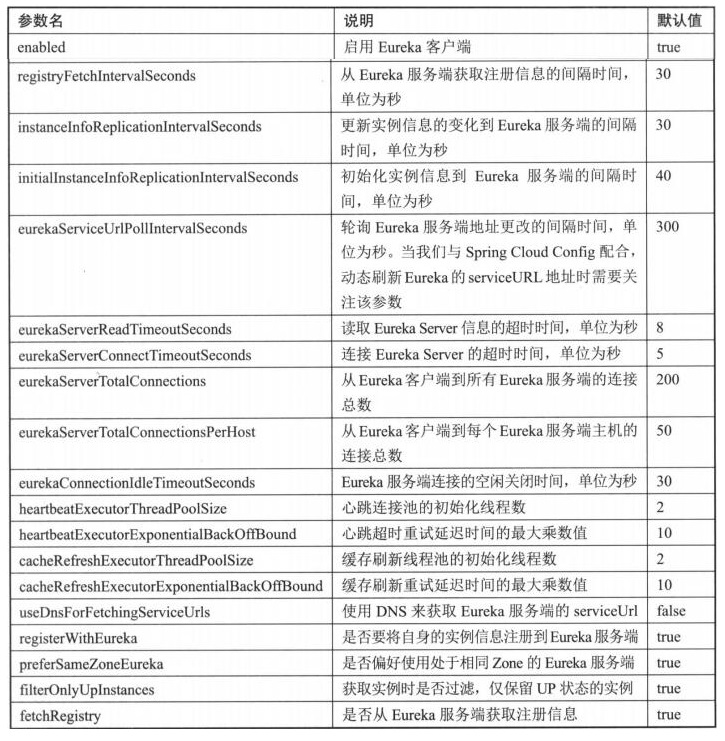
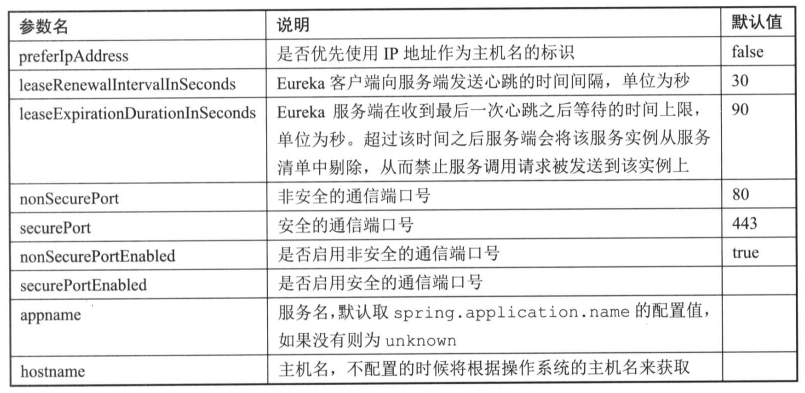

服务治理: Spring Cloud Eureka
=========

## 1、微服务架构服务维护问题：
- 服务注册：
- 服务发现：

## 2、Netflix Eureka：
- 包含服务端和客户端组件，均采用Java编写，主要适用于通过Java实现的分布式系统

- Eureka 服务端：
	服务注册中心，支持高可用配置，依托强一致性提供良好的服务实例可用性。

- Eureka 客户端：
	服务的注册与发现，客服端服务通过注解和参数配置方式嵌入在程序中。当程序运行时，Eureka 客户端向注册中心注册自身提供服务并周期性的发送心跳来更新它的服务租约。

## 3、搭建服务注册中心
#### 3.1、创建基础 Spring Boot 工程，并在 pom.xml 中引入必要的依赖内容
```xml
	<parent>
		<groupId>org.springframework.boot</groupId>
		<artifactId>spring-boot-starter-parent</artifactId>
		<version>2.1.7.RELEASE</version>
		<relativePath/> <!-- lookup parent from repository -->
	</parent>

	<properties>
		<project.build.sourceEncoding>UTF-8</project.build.sourceEncoding>
		<project.reporting.outputEncoding>UTF-8</project.reporting.outputEncoding>
		<java.version>1.8</java.version>
		<maven.compiler.source>1.8</maven.compiler.source>
		<maven.compiler.target>1.8</maven.compiler.target>
		<spring-cloud.version>Greenwich.SR2</spring-cloud.version>
	</properties>

	<dependency>
		<groupId>org.springframework.cloud</groupId>
		<artifactId>spring-cloud-starter-netflix-eureka-server</artifactId>
	</dependency>

	<dependencyManagement>
		<dependencies>
			<dependency>
				<groupId>org.springframework.cloud</groupId>
				<artifactId>spring-cloud-dependencies</artifactId>
				<version>${spring-cloud.version}</version>
				<type>pom</type>
				<scope>import</scope>
			</dependency>
		</dependencies>
	</dependencyManagement>
```

#### 3.2、通过注解启动一个服务注册中心，在Spring Boot应用启动类中添加@EnableEurekaServer注解

- 在默认设置下，该服务注册中心也会将自己注册为客服端，所以我们需要禁用它的客户端注册行为，在application.yml文件中加入如下配置：

```yml
eureka:
  instance:
	hostname: eureka1
  client:
	# 注册为Eureka服务
	register-with-eureka: false
	# 检索服务
	fetch-registry: false
	service-url:
	  defaultZone: http://mw2.odev.com:8761/eureka
```
#### 3.3、启动服务，访问http://localhost:8080

- 在Eureka信息面板中，Instances currently registered with Eureka下面就是注册中心注册的服务列表，现在还没有服务，接下来注册服务。

## 4、注册服务提供者
#### 4.1、改造基础Spring Boot工程，增加Eureka依赖
```xml
<dependency>
	<groupId>org.springframework.boot</groupId>
	<artifactId>spring-boot-starter-web</artifactId>
</dependency>
<dependency>
	<groupId>org.springframework.cloud</groupId>
	<artifactId>spring-cloud-starter-netflix-eureka-client</artifactId>
	<version>2.1.2.RELEASE</version>
</dependency>
```

#### 4.2、添加请求处理接口、配置文件、注解

- 客户端启动类加上注解：@EnableDiscoveryClient
- 配置文件：

```yml
server:
  port: 8081

spring:
  application:
	name: hello-service

eureka:
  client:
	service-url:
	  defaultZone: http://localhost:8080/eureka
```
- 启动客户端，访问Eureka注册中心，可以看到客户端服务已经注册成功

## 5、高可用注册中心
Eureka Server的高可用实际上就是将自己作为服务向其它服务注册中心注册自己，这样就可以形成一组互相注册的服务注册中心，实现服务清单的相互同步，达到高可用的效果。

#### 5.1、在原有单节点注册中心上进行改造
- 创建 application-eureka1.yml

```yml
server:
  port: 8181

spring:
  profiles:
	active: eureka1
  application:
	name: eureka-service

eureka:
  instance:
	hostname: eureka1
  client:
	# 是否注册为服务
	register-with-eureka: true
	# 是否检查服务
	fetch-registry: true
	service-url:
	  defaultZone: http://localhost:8282/eureka
```

- 创建 application-eureka2.yml

```yml
server:
  port: 8282

spring:
  profiles:
	active: eureka2
  application:
	name: eureka-service

eureka:
  instance:
	hostname: eureka2
  client:
	# 是否注册为服务
	register-with-eureka: true
	# 是否检查服务
	fetch-registry: true
	service-url:
	  defaultZone: http://localhost:8181/eureka
```

- 使用IDE分别以两个不同配置启动(加参数)项目
 - --spring.profiles.active=eureka1
 - --spring.profiles.active=eureka2

## 6、Eureka详解

#### 6.1、基础架构
- 服务注册中心：Eureka提供的服务端，提供服务注册与发现功能
- 服务提供者：提供服务的应用，将自己提供的服务注册到Eureka，以供其它应用发现
- 服务消费者：消费者应用从服务注册中心获取服务列表，从而使消费者可以知道去何处调用其所需服务；常用ribbon、feign

###### 很多时候，客户端既是服务提供者也是服务消费者

#### 6.2、服务治理机制

###### Eureka基础架构中各个元素的一些通信行为


- **服务提供者**
	- 服务注册

	   服务提供者在启动的时候会通过发送REST请求的方式将自己注册到Eureka Server上，Eureka Server将服务信息储存在一个双层结构Map中，第一层的key是服务名，第二层的key是具体服务的实例名。

	- 服务同步

		 当服务提供者发送注册请求到一个服务注册中心是，它会将该请求转发给集群中相连的其他注册中心，从而实现注册中心之间的服务同步，可以通过这两台服务注册中心中的任意一台获取到服务

	- 服务续约

	 服务提供者会维护一个心跳用来持续告诉Eureka Server：“我还活着”，以防止Eureka Server的“剔除任务”将该服务从服务列表中排出出去，该操作为服务续约(Renew)

		```yml
		eureka:
		  instance:
				# 用于定义服务续约任务的调用间隔时间，默认30秒
		    lease-renewal-interval-in-seconds: 30
				# 用于定义服务失效的时间，默认90秒
		    lease-expiration-duration-in-seconds: 90
		```

- **服务消费者**
	- 获取服务

	 启动服务消费者时，它会发送一条REST请求给服务注册中心，来获取上面注册的服务清单。为了性能考虑，Eureka Server会维护一份只读的服务清单来返回给客户端，同时该缓存清单会每隔30秒更新一次。

	```yml
		eureka:
		  client:
		    fetch-registry: true
				# 缓存清单更新时间间隔
		    registry-fetch-interval-seconds: 30
	```

	- 服务调用

	 服务消费者在获取服务清单后，通过服务名可以获取具体提供服务的实例名和该实例的元数据信息。Ribbon会默认采用轮询的方式进行调用，从而实现客户端的负载均衡。

	- 服务下线

	 当服务实例进行正常的关闭操作时，它会触发一个服务下线的REST请求给Eureka Server，告诉服务注册中心：“我要下线了”。服务端在接收到请求后，将该服务状态置为下线(DOWN)，并把该下线事件传播出去。

- **服务注册中心**
	- 失效剔除

	 Eureka Server在启动的时候会创建一个定时任务，默认每隔一段时间(默认为60秒)将当前清单中超时(默认为90秒)没有续约的服务剔除出去。

	- 自我保护

	 Eureka Server在运行期间，会统计心跳失败的比例在15分钟之内是否低于85%，如果低于，会将当前的实例注册信息保护起来，让这些实例不会过期。但在保护期间内实例出现问题，客户端很容易拿到实际不存在的服务实例，所以客户端必须要有容错机制，比如请求重试、断路器等。

	 ```yml
	 eureka:
	   server:
	     # 自我保护机制，默认true
	     enable-self-preservation: false
	 ```

## 7、配置详解

Eureka服务端更多地类似于一个现成的产品，大多数情况下，我们不需要修改它的配置信息。

Eureka客户端的配置主要分为以下两个方面：
- 服务注册相关的配置信息，包括服务注册中心的地址、服务获取的间隔时间、可用区域等。
- 服务实例相关的配置信息，包括服务实例的名称、IP地址、端口号、健康检查路径等。

#### 7.1、服务注册类配置
- **指定注册中心**
	默认值的key为defaultZone、value为http://localhost:8761/eureka/
	```yml
	eureka:
	  client:
	    service-url:
				# 自定义注册中心地址
	      defaultZone: http://localhost:9222/eureka
	```
###### 当构建了高可用的注册中心集群时，我们可以为参数的value值配置多个注册中心的地址(通过逗号分隔)

- **其它配置**
	```yml
	# Eureka常用配置参数
	eureka:
	  client:
	    # 启用Eureka客户端，默认值：true
	    enabled: true
	    # 是否要将自身的实例信息注册到Eureka服务端，默认值：true
	    register-with-eureka: true
	    # 是否从Eureka服务端获取注册信息，默认值：true
	    fetch-registry: true
	    # 从Eureka服务端获取注册信息间隔时间(单位秒)，默认值：30
	    registry-fetch-interval-seconds: 30
	    # 自定义注册中心地址，默认值：http://localhost:8761/eureka/
	    service-url:
	      defaultZone: http://localhost:9222/eureka
	    # 更新实例信息的变化到Eureka服务端的时间间隔(秒)，默认值：30
	    instance-info-replication-interval-seconds: 30
	    # 初始化实例信息到Eureka服务端的时间间隔(秒)，默认值：40
	    initial-instance-info-replication-interval-seconds: 40
	    # 轮询Eureka服务端地址更改的时间间隔(秒)，默认值：300
	    # 与Spring Cloud Config配合，动态刷新Eureka的server URL地址时需关注该参数
	    eureka-service-url-poll-interval-seconds: 300
	    # 读取Eureka服务信息的超时时间(秒)，默认值：8
	    eureka-server-read-timeout-seconds: 8
	    # 连接Eureka服务的超时时间(秒)，默认值：5
	    eureka-server-connect-timeout-seconds: 5
	    # 从Eureka客户端到所有Eureka服务端的连接总数，默认值：200
	    eureka-server-total-connections: 200
	    # 从Eureka客户端到每个Eureka服务端的连接总数，默认值：50
	    eureka-server-total-connections-per-host: 50
	    # Eureka服务端的空闲关闭时间(秒)，默认值：30
	    eureka-connection-idle-timeout-seconds: 30
	    # 心跳连接池的初始化线程数，默认值：2
	    heartbeat-executor-thread-pool-size: 2
	    # 心跳超时重试延迟时间的最大乘数积，默认值：10
	    heartbeat-executor-exponential-back-off-bound: 10
	    # 缓存刷新池的初始化线程数，默认值：2
	    cache-refresh-executor-thread-pool-size: 2
	    # 缓存刷新重试延迟时间的最大乘数积，默认值：10
	    cache-refresh-executor-exponential-back-off-bound: 10
	```



#### 7.2、服务实例类配置
- **元数据**
	它是Eureka客户端在向服务注册中心发送注册请求时，用来描述自身服务信息的对象，其中包含了一些标准化的元数据，比如服务名称实例名称、实例IP、实例端口等用于服务治理的重要信息;以及一些用于负载均衡策略或是其他特殊用途的自定义元数据信息。

	我们可以通过eureka.instance.<properties>=<value>的格式对标准化元数据直接进行配置，其中<properties>就是EurekaInstanceConfigBean对象中的成员变量名。而对于自定义元数据，可以通过eureka. instance.metadataMap.<key>=<value>的格式来进行配置，比如:eureka.instance.metadataMap.zone=shanghai

- **实例名配置**
	即InstanceInfo中的instanceId参数，它是区分同一服务中不同实例的唯一标识。在Ntfix Eureka的原生实现中，实例名采用主机名作为默认值，这样的设置使得在同一主机上无法启动多个相同的服务实例。所以，在Spring Cloud Eureka的配置中，针对同一主机中启动多实例的情况，对实例名的默认命名做了更为合理的扩展，它采用了如下默认规则:(主机名:应用名:实例id:服务端口)
	```yml
	${spring.cloud.client.hostname}:${spring.application.name}:$(spring.application.instance_id:${server.port)
	```

- **端点配置**
	使用eureka.instance.statusPageUrlPath和eureka.instance.healthCheckUrlPath参数，它们都使用相对路径来进行配置。由于Eureka的服务注册中心默认会以HTTP的方式来访问和暴露这些端点，因此当客户端应用以HTTPS的方式来暴露服务和监控端点时,相对路径的配置方式就无法满足需求了。所以，Spring Cloud Eureka还提供了绝对路径的配置参数，具体示例如下所示:

	```yml
eureka.instance.statusPageUrl=https://${eureka.instance.hostname}/info
eureka.instance.healthCheckurl=https://${eureka.instance.hostname}/health
eureka.instance.homePageUrl=https://$ feureka.instance.hostname}/
	```

- **健康检测**
	默认情况下，Eureka中各个服务实例的健康检测是依靠客户端心跳的方式来保持服务实例的存活。默认的心跳实现机制可以有效检查客户端进程是否正常运作，但却无法保证客户端应用能够正常提供服务。

	在Spring Cloud Eureka中，我们可以通过简单的配置，吧Eureka客户端的健康检测交给spring-boot-actuator模块的/health端点，以实现更加全面的健康状态维护。详细步骤如下：
	- 在pom.xml中引入spring-boot-starter-actuator模块的依赖
	- 在application.yml中增加参数配置
		```yml
		eureka:
		  client:
		    healthcheck:
		      enabled: true
		```
	- 如果客户端的/health端点路径做了一些特殊处理，参考端点配置时的方法进行配置，让服务注册中心可以正确访问到健康检测端点。

- **其它配置**
	```yml
	eureka:
	  instance:
	    # 是否优先使用IP地址作为主机名的标识，默认值：false
	    prefer-ip-address: false
	    # Eureka客户端向服务端发送心跳间隔(秒)，默认值：30
	    lease-renewal-interval-in-seconds: 30
	    # Eureka服务端在收到最后一次心跳之后等待的上限时间(秒)，默认值：90
	    lease-expiration-duration-in-seconds: 90
	    # 非安全的通信端口，默认值：80
	    non-secure-port: 80
	    # 安全的通信端口，默认值：443
	    secure-port: 443
	    # 是否启用非安全的通信端口，默认值：true
	    non-secure-port-enabled: true
	    # 是否启用非安全的通信端口
	    secure-port-enabled: false
	    # 服务名，默认取spring.application.name的值，没有则为unknown
	    appname:
	    # 主机名，不设置将根据操作系统的主机名来获取
	    hostname:
	```


## 8、跨平台支持

Eureka 的通信机制使用了HTTP的REST接口实现，这也是Eureka同其他服务注册工具的一个关键不同点。由于HTTP的平台无关性,虽然Eureka Server通过Java实现，但是在其下的微服务应用并不限于使用Java来进行开发。

目前除了Eureka 的Java 客户端之外，还有很多其他语言平台对其的支持，比如 eurekajs-client、python-eureka 等。需要了解更多关于Eureka的REST API内容可以查看Eureka官方WiKi中的Eureka-RESToperations一文 https:/github.con/Nthix/eurka/wikiEureka-REST-operations。

#### 通信协议

默认情况下，Eureka 使用Jersey和XStream配合JSON作为Server 与Client之间的通信协议。你也可以选择实现自己的协议来代替。

- Jersey 是JAX-RS的参考实现，它包含三个主要部分
	- 核心服务器(Core Server): 通过提供JSR 311中标准化的注释和API标准化，你可以用直观的方式开发RESTful Web服务。
	- 核心客户端(Core Client): Jersey客户端API 帮助你与REST服务轻松通信。
	- 集成(Integration): Jersey还提供可以轻松集成Spring、Guice、Apache Abdera的库。

- XStream 是用来将对象序列化成XML(JSON)或反序列化为对象的一个Java类库。XStream在运行时使用Java反射机制对要进行序列化的对象树的结构进行探索，并不需要对对象做出修改。XStream 可以序列化内部字段，包括private和final字段，并且支持非公开类以及内部类。默认情况下，XStream 不需要配置映射关系，对象和字段将映射为同名XML元素。但是当对象和字段名与XML中的元素名不同时，XStream支持指定别名。XStream 支持以方法调用的方式，或是Java标注的方式指
定别名。XStream 在进行数据类型转换时，使用系统默认的类型转换器。同时，也支持用户自定义的类型转换器。
